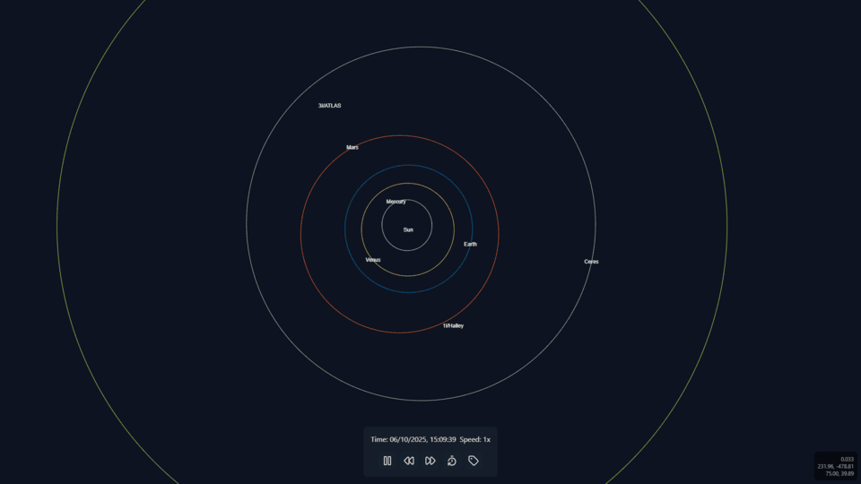

# Kepler Solar System 2d

| example                        |
| ------------------------------ |
|  |

An interactive real-time simulation of our solar system, built with Svelte and TypeScript.

## What is this?

This project simulates the movement of planets and other celestial bodies using real physics based on Keplerian orbital elements.

## Key Features

- **Accurate simulation**: Uses real orbital elements to calculate positions and velocities of planets
- **Planets and bodies**: Includes all major planets in the solar system.
- **Interactive visualization**: HTML5 Canvas with zoom, pan and speed controls
- **Dynamic trails**: Shows the path traveled by celestial bodies
- **Modern interface**: Built with Svelte 5, TypeScript and Tailwind CSS

## How to run

```bash
# Install dependencies
pnpm install

# Run in development
pnpm dev

# Build for production
pnpm build
```

Then just open your browser at `http://localhost:5173` and enjoy the show!

## How it works under the hood

- **Keplerian elements**: Each planet has its real orbital parameters (semi-major axis, eccentricity, inclination, etc.)
- **Real-time conversion**: Positions are calculated in real-time based on the current time
- **Numerical integration**: Comets use numerical integration to calculate their trajectory under the Sun's gravitational influence
- **Optimization**: Smart trails and performance limits to keep everything running smoothly

## Technologies used

- Svelte 5 (modern web framework)
- TypeScript (static typing)
- Tailwind CSS (styling)
- HTML5 Canvas (rendering)
- Vite (build tool)

## Important files

- `src/lib/bodies.ts` - Defines all celestial bodies and their orbital parameters
- `src/lib/simulation.ts` - Main physics simulation logic
- `src/lib/components/Canvas.svelte` - Main canvas component
- `src/lib/kepler.ts` - Orbital calculations based on Keplerian elements

Have fun exploring the cosmos!
